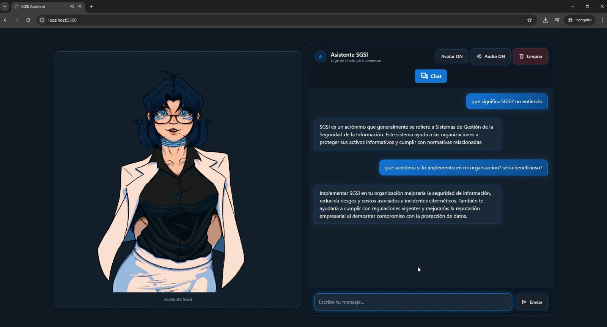
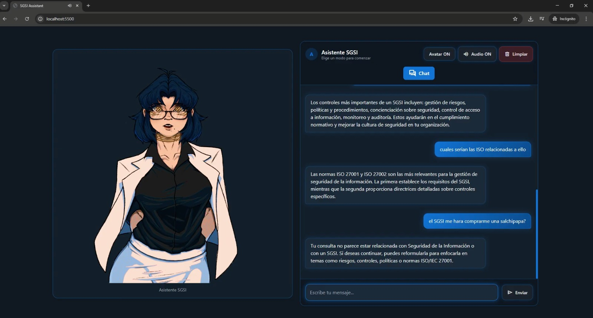

# 🎨 Frontend – Chatbot SGSI

Frontend del **Chatbot SGSI**, diseñado para interactuar con el backend y permitir al usuario enviar consultas al modelo LLM.  
Desarrollado en **HTML + JavaScript**, con consumo de API vía HTTP y despliegue en **Vercel**.  
Soporta conexión con backend local o mediante URL pública generada con **Cloudflared**.

---

## 🖼 Vista del Sistema en Funcionamiento

  

  

---

# ⚙ Instalación

## 1️⃣ Configurar URL del Backend
### Edita el archivo `app.js`:

// app.js

const API_URL = "http://localhost:8000/chat";

audio = new Audio("http://localhost:8000" + data.audio_url); 

💡 Nota: Si usas el backend con Cloudflared, reemplaza "http://localhost:8000" por la URL proporcionada por el túnel.

---

## 2️⃣ Ejecutar frontend local
### Usando Python para levantar un servidor local:

python -m http.server 5500

### Abrir en el navegador:

http://localhost:5500

✅ Comentario: Esto sirve para pruebas locales antes de desplegar en Vercel.

---

## 3️⃣ Despliegue en Vercel
### Pasos:

Crear cuenta en Vercel si no tienes.

Conectar el repositorio del frontend a Vercel.

Configurar la variable de entorno BACKEND_URL con la URL del backend (Cloudflared o remoto).

Desplegar y obtener la URL pública del frontend.

---

## 🖼 Integración del Avatar
El avatar fue diseñado por un colaborador externo.

Crédito: https://x.com/GaboAsies_Bv

💡 Nota: Mantener los créditos visibles si se reutiliza o publica el frontend.

---

## 📈 Características Técnicas

✔ HTML + JavaScript puro, ligero y rápido

✔ Comunicación con backend vía API REST

✔ Configurable para backend local o remoto

✔ Despliegue sencillo en Vercel

✔ Compatible con navegadores modernos

✔ Integración de avatar gráfico y mensajes dinámicos

---

## 🔧 Verificación del Frontend
Abrir http://localhost:5500 en el navegador.

Revisar la consola de JavaScript para errores de conexión con el backend.

Asegurarse de que el backend esté corriendo y la URL sea correcta.

---

## 📜 Licencia

Código bajo **licencia MIT**.

El avatar y recursos gráficos cuentan con permisos de su autor original.

---

## 👨‍💻 Autor

Rodrigo Alexander Pinto Niño
